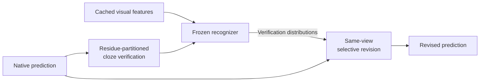

# RPTCR

**Residue-Partitioned Terminal Cloze Revision for scene text recognition.**

RPTCR revises a recognizer's final prediction without additional training. It masks groups of predicted tokens, reuses the recognizer to verify them against the image and remaining context, and accepts replacements through same-view selective revision.

This repository contains the revision code used with MDiff4STR and PIMNet, their experiment settings, and unit tests. The code takes a recognizer's terminal state as input; the model, checkpoint, and image-to-text runner are supplied separately.

[MDiff4STR guide](docs/mdiff4str.md) · [PIMNet guide](docs/pimnet.md) · [Evaluation notes](docs/evaluation.md)

## Method

1. **Residue-partitioned cloze verification.** Group positions by their index modulo `K`. Mask each group in a separate copy of the final prediction and read its verification distribution using cached visual features and the remaining characters.
2. **Same-view selective revision.** Compare the candidate and original token under that same distribution. Accept a replacement when `log p(candidate) - log p(original) > tau`.

Each position is read from its assigned masked view. All views use the original sequence, and accepted replacements are applied together.



## Try the acceptance rule

The synthetic example shows how the edit threshold keeps or replaces a token. It uses NumPy and requires no model checkpoint. Run these commands from the repository root in a Python environment with NumPy:

```bash
git clone https://github.com/xuanzhi-2026/RPTCR.git
cd RPTCR
python -m pip install numpy
python -m examples.synthetic_gate
```

Expected output:

```text
Constructed input: [[0, 0]]
Revised token IDs: [[1, 0]]
Accepted positions: [[True, False]]
```

The two positions have log-probability advantages of `3.0` and `0.5`. With a threshold of `2.0`, only the first token is replaced. See [examples/synthetic_gate.py](examples/synthetic_gate.py) for the inputs.

## Use with a recognizer

The two backends use separate environments. Each guide describes the upstream version, required terminal state, API call, and returned values.

| Recognizer | Recorded experiment environment | Guide |
| --- | --- | --- |
| MDiff4STR | Python 3.8.20, PyTorch 2.2.0+cu118, CUDA 11.8 | [MDiff4STR](docs/mdiff4str.md) |
| PIMNet | Python 3.6.13, TensorFlow 1.12.0, NumPy 1.16.6, CPU | [PIMNet](docs/pimnet.md) |

The recorded settings distinguish native decoding from the additional verification views:

| Recognizer | Native decoding steps | Verification views | Edit threshold |
| --- | --- | --- | --- |
| MDiff4STR-B | Up to 5, preserving early exit | 4 | `0.8817490935325623` |
| PIMNet | 5 | 5 | `1.404470682144165` |

The JSON files in [configs](configs) record these settings. The Python modules use matching constants; they do not load the JSON files at runtime. Keep the recognizer's weights, preprocessing, vocabulary, and decoding settings fixed when comparing its native and revised outputs. [Evaluation notes](docs/evaluation.md) describe the comparison and token handling.

## Tests

```bash
python -m unittest discover -s tests -v
```

The tests cover residue masking, assigned-view readout, simultaneous replacement, threshold ties, EOS handling, and input preservation. Three tensor tests also require PyTorch and are skipped when it is absent. Test history and the scope of the checks are recorded in [validation.md](docs/validation.md).

## Repository layout

| Path | Contents |
| --- | --- |
| [rptcr](rptcr) | MDiff4STR readout, PIMNet revision, and TensorFlow graph helper |
| [configs](configs) | Recorded model-specific settings |
| [examples](examples) | Synthetic acceptance example |
| [tests](tests) | Source-lock, import, and algorithm tests |
| [docs](docs) | Backend guides, evaluation notes, and source and validation records |

## Upstream code and license

The recognizer implementations are [OpenOCR / MDiff4STR](https://github.com/Topdu/OpenOCR) and [PIMNet](https://github.com/Pay20Y/PIMNet). Use their documentation to obtain the model code and checkpoints, and cite the corresponding papers when using those recognizers. The exact source revisions and extraction details are listed in [provenance.md](docs/provenance.md).

A license for this repository has not yet been selected. The external recognizers and their assets remain subject to their respective upstream licenses.
